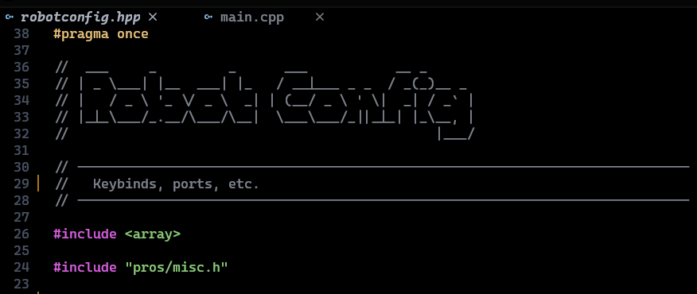

# toilet-comment.nvim

Convert text to ASCII art comments using [toilet](http://toilet.sourceforge.net/) in Neovim.



## Requirements

- Neovim >= 0.7.0
- [toilet](http://toilet.sourceforge.net/) installed on your system

### Installing toilet

```bash
# Debian/Ubuntu
sudo apt install toilet

# Arch Linux
sudo pacman -S toilet

# macOS (with Homebrew)
brew install toilet

# Fedora
sudo dnf install toilet
```

## Installation

### lazy.nvim

```lua
{
  "Deen-Weible/toilet-comment.nvim",
  config = function()
    require("toilet_comment").setup({
      font = "standard", // change to a font that exists on your system!
      add_space_below = true,
    })
  end,
  keys = {
    { "<leader>ta", ":ToiletComment<CR>", mode = "v", desc = "ASCII Comment" },
    { "<leader>ti", ":ToiletCommentInteractive<CR>", mode = "v", desc = "ASCII Comment (Interactive)" },
  },
}
```

### packer.nvim

```lua
use {
  "Deen-Weible/toilet-comment.nvim",
  config = function()
    require("toilet_comment").setup()
  end,
}
```

### Manual Installation

Clone the repository and copy the files to your Neovim config directory:

```bash
git clone https://github.com/yourusername/toilet-comment.nvim.git
cp -r toilet-comment.nvim/lua/* ~/.config/nvim/lua/
cp -r toilet-comment.nvim/plugin/* ~/.config/nvim/plugin/
cp -r toilet-comment.nvim/doc/* ~/.config/nvim/doc/
```

## Usage

### Visual Mode Commands

1. Select text in visual mode
2. Run one of the following commands:

| Command                     | Description                                                   |
| --------------------------- | ------------------------------------------------------------- |
| `:ToiletComment`            | Convert selection to ASCII art comment with default font      |
| `:ToiletCommentFont <font>` | Convert with a specific font (e.g., `:ToiletCommentFont big`) |
| `:ToiletCommentInteractive` | Open interactive font picker                                  |

### Example

Select this text:

```
comment!
```

Run `:ToiletComment` and get:

```
--                             _   _
--  __ ___ _ __  _ __  ___ _ _| |_| |
-- / _/ _ \ '  \| '  \/ -_) ' \  _|_|
-- \__\___/_|_|_|_|_|_\___|_||_\__(_)
--
```

## Configuration

Call `setup()` with optional configuration:

```lua
require("toilet_comment").setup({
  font = "standard",        -- Default toilet font
  add_space_below = true,   -- Add empty comment line below
  comment_prefix = nil,     -- nil = auto-detect by filetype
})
```

### Default Comment Prefixes by Filetype

| Filetype                                 | Prefix  |
| ---------------------------------------- | ------- |
| Lua                                      | `-- `   |
| Python, Ruby, Bash                       | `# `    |
| JavaScript, TypeScript, C, C++, Rust, Go | `// `   |
| Vim                                      | `" `    |
| HTML                                     | `<!-- ` |
| CSS                                      | `/* `   |

## Available Fonts

Common fonts include: `standard`, `big`, `block`, `banner`, `digital`, `future`, `gothic`, `script`

To see all available fonts on your system, run:

```bash
toilet -I
```

## License

MIT License
